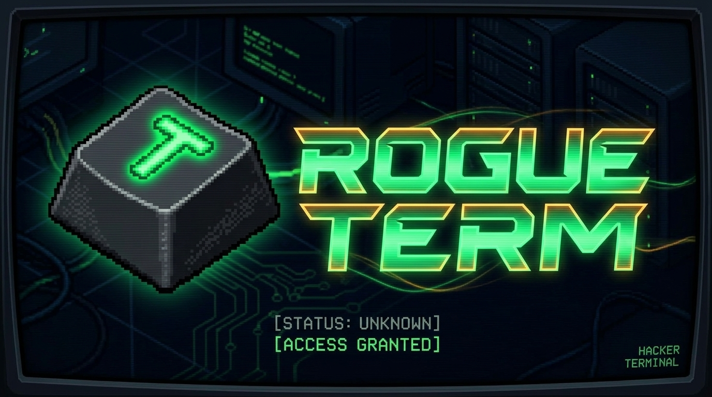
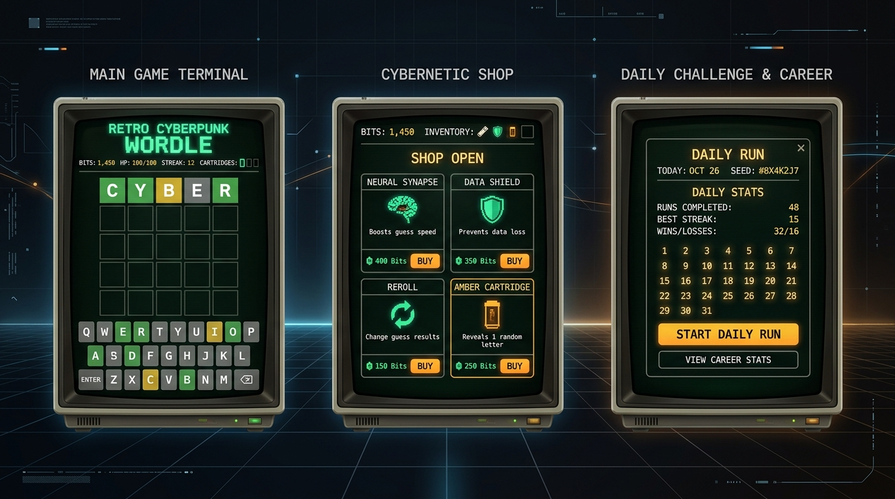

<p align="center">
  
</p>

<p align="center">
  <strong>O roguelike de adivinhação de palavras com estética cyberpunk de terminal</strong>
</p>

<p align="center">
  
  
  
  
  
</p>

<p align="center">
  🎮 <strong>Jogue agora: <a href="https://mariogomesbarbosa.github.io/rogue-term/">Rogue Term no GitHub Pages</a></strong><br>
  <sub>Abre direto no navegador — 100% estático, sem cadastro, com áudio sintetizado e suporte mobile & desktop.</sub>
</p>

<p align="center">
  
</p>

---

## 📌 Sobre o Rogue Term

**Rogue Term** funde a lógica dedutiva do clássico *Wordle / Termo* com a adrenalina de progressão e *deckbuilding* tático dos jogos *roguelike*.

No papel de um invasor cibernético conectado a um terminal retrô de fósforo verde, sua missão é quebrar as credenciais de segurança dos nós de rede antes que a integridade do seu hardware se esgote. Cada palavra decifrada rende **Bits**, que podem ser investidos em **Cartuchos de Expansão** e **Sinapses Neurais** no mercado clandestino entre rodadas, criando sinergias poderosas para enfrentar setores cada vez mais desafiadores.

---

## ✨ Destaques & Mecânicas

- 🧩 **Adivinhação Roguelike de 5 Letras** — O desafio tradicional de palavras em português ganha camadas estratégicas: número limitado de chutes, recompensas por velocidade e penalidades por falhas críticas.
- 💾 **Cartuchos & Sinapses** — Colete módulos passivos que alteram as regras do jogo: revele letras ocultas, ganhe bits bônus em chutes perfeitos, duplique multiplicadores ou instale firewalls contra erros.
- 🛒 **Mercado Clandestino (Shop)** — Gaste seus bits entre setores para adquirir novos cartuchos, vender módulos antigos ou acionar rerolls buscando a build perfeita.
- 📅 **Desafio Diário Determinístico** — Um novo setor global a cada 24 horas gerado por PRNG determinístico (*Mulberry32*). A mesma palavra e sequência para todos os jogadores do mundo competirem em igualdade.
- 🎲 **Seeds Customizadas & Carreira Livre** — Compartilhe códigos de seed únicos (ex: `CYBERPUNK`, `MATRIX99`) com amigos ou jogue sem limites no modo Carreira Livre.
- ♾️ **Modo Infinito** — Conquistou o Setor 5? Continue no modo Endless para testar os limites matemáticos dos seus combos.
- 📺 **Atmosfera Retrô CRT & Áudio Háptico** — Scanlines nostálgicas, curvatura e brilho de fósforo, complementados por cliques táteis de teclas mecânicas (*thocks*) e sintetizadores Web Audio em tempo real, sem downloads pesados.

---

## 🕹️ Como Jogar

```
[ T ] [ E ] [ R ] [ M ] [ O ]
  🟩    🟨    ⬛    ⬛    🟩
```

1. **Digite uma palavra válida de 5 letras** e pressione `ENTER`.
2. Observe o feedback do terminal:
   - 🟩 **Verde:** Letra correta na posição exata.
   - 🟨 **Amarelo:** Letra presente na palavra, mas em outra posição.
   - ⬛ **Escuro:** Letra inexistente na palavra criptografada.
3. Decifre a palavra antes de esgotar as tentativas para coletar **Bits** e avançar de estágio.
4. Entre as rodadas, visite o **Mercado** para comprar cartuchos, curar integridade ou aprimorar seu terminal.
5. Supere o **Setor 5** para vencer a corrida ou aceite o desafio do **Modo Infinito**!

---

## 🛠️ Tecnologias & Arquitetura

O projeto foi construído com foco em máxima performance, zero dependência de servidores no gameplay e renderização instantânea:

- **[Next.js 16](https://nextjs.org/)** com **Turbopack** e exportação totalmente estática (`output: export`)
- **[React 19](https://react.dev/)** + **[TypeScript](https://www.typescriptlang.org/)** com tipagem estrita
- **[Tailwind CSS](https://tailwindcss.com/)** para estilização utilitária e efeitos de monitor CRT
- **[Zustand](https://github.com/pmndrs/zustand)** para gerenciamento de estado global com persistência no LocalStorage
- **Web Audio API** — Efeitos sonoros gerados proceduralmente via síntese de áudio (osciladores e ruído rosa)
- **PRNG Mulberry32** — Geração pseudo-aleatória com semente (seed) determinística para desafios diários
- **[Lucide Icons](https://lucide.dev/)** — Ícones vetoriais leves com temática cibernética

---

## 🚀 Como Executar Localmente

### Pré-requisitos
- **Node.js** 18.17+ ou superior
- **npm**, **pnpm** ou **yarn**

### Instalação

```bash
# 1. Clone o repositório
git clone https://github.com/mariogomesbarbosa/rogue-term.git

# 2. Acesse a pasta do projeto
cd rogue-term

# 3. Instale as dependências
npm install

# 4. Inicie o servidor de desenvolvimento
npm run dev
```

Abra [http://localhost:3000](http://localhost:3000) no seu navegador para jogar.

### Build de Produção

```bash
# Gera a versão estática otimizada na pasta /out
npm run build
```

---

## 📄 Licença

Este projeto está licenciado sob a **[Creative Commons Atribuição-NãoComercial-CompartilhaIgual 4.0 Internacional (CC BY-NC-SA 4.0)](LICENSE)**.

- 🟢 **Permitido:** Estudo, cópia, alteração, modificação e contribuição de código para projetos pessoais e educacionais.
- 👤 **Atribuição:** É obrigatório dar os devidos créditos ao autor original ([Mário Barbosa](https://github.com/mariogomesbarbosa)), incluir link para esta licença e indicar quaisquer alterações realizadas.
- 🚫 **Uso Não Comercial:** O material e suas derivações **não podem** ser utilizados para finalidades comerciais ou monetização de qualquer tipo.
- 🔁 **CompartilhaIgual:** Quaisquer trabalhos derivados devem ser distribuídos sob os mesmos termos desta licença.

<p align="center">
  <sub>Desenvolvido com 💚 por <a href="https://github.com/mariogomesbarbosa">Mário Barbosa</a></sub>
</p>
