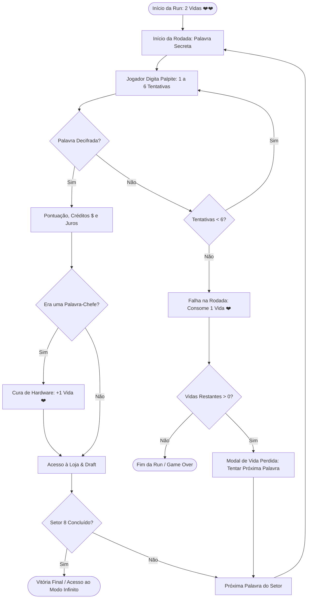

# Game Design Document (GDD): Rogue Term

**Versão:** 0.4 (The Lives, Synergies & Daily Seed Edition)  
**Gênero:** Word Puzzle / Roguelike Deckbuilder & State Manipulator  
**Inspirações Centrais:** *Termo / Wordle*, *Balatro*, *Slay the Spire*  
**Plataforma Alvo:** Web (Mobile-First / Desktop PWA - GitHub Pages Static Export)  
**Direção Visual:** Retrô Arcade / Balatro CRT Aesthetic com Tema de Teclado Mecânico (Keycaps táteis, Switch Thock, Glow Neon)

---

## 1. Visão Geral do Jogo (High Concept)

**Rogue Term** funde o quebra-cabeça clássico de dedução de palavras (*Termo / Wordle*) com a progressão viciante e sinérgica de *Balatro*, ambientado em uma atmosfera retrô de digitação e computação analógica.

O jogador embarca em uma jornada roguelike por **8 Setores** (com 3 Fases cada: Base, Avanço e Chefe), gerenciando um **Sistema de Vidas [❤️ ❤️]**, construindo seu deck com **Cartas de Habilidade Ativas (Hacks de Terminal)** e **Relíquias Passivas (Switches e Hardware Modificado)**, enfrentando **Palavras-Chefe com Anomalias de Sistema** e competindo no **Desafio Diário (Daily Run com Seed)** e no **Modo Infinito**.

---

## 2. Direção de Arte & Sensação do Jogo (Juice & Aesthetic)

O jogo adota a identidade visual e o design sensorial de **Balatro** mesclado com a estética de **Teclados Mecânicos Retrô**:

```
+-------------------------------------------------------------+
| [CRT Scanlines & Glow Filter]                               |
|                                                             |
|  [SETOR 3 / FASE 3 CHEFE]   [PONTOS: 14.850]   [VIDAS: ❤️ ❤️] |
|                                                             |
|  +---------------------+  +-------------------------------+ |
|  | CARTAS / ATALHOS    |  |         GRID DA PALAVRA       | |
|  | [Retro-Edição] (1)  |  |   [ P ] [ E ] [ D ] [ R ] [ A ] | |
|  | [Sonda] (2)         |  |   [ P ] [ O ] [ R ] [ T ] [ O ] | |
|  |                     |  |   [ _ ] [ _ ] [ _ ] [ _ ] [ _ ] | |
|  | [Switch Dourado]    |  |   [ _ ] [ _ ] [ _ ] [ _ ] [ _ ] | |
|  +---------------------+  +-------------------------------+ |
|                                                             |
|          [TECLADO VIRTUAL RETRÔ COM FEEDBACK TÁTIL]          |
+-------------------------------------------------------------+
```

### 2.1 Elementos Visuais e Sensoriais
- **Recurso Vital: Vidas [❤️ ❤️] (Issue #37):**
  - O jogador começa com **2 Vidas** de hardware (capacidade inicial 2/2).
  - Cada rodada permite até **6 tentativas** clássicas de dedução. Se esgotar as 6 tentativas sem decifrar a palavra, perde **1 Vida**. Se as vidas chegarem a 0, a run é encerrada (*Game Over*).
- **Shader/Filtro CRT Dinâmico:** Scanlines horizontais suaves, vinheta sutil, leve flicker e aberração cromática retrô (com botão de alternância para modo minimalista limpo).
- **Paleta de Cores Balatro:** Fundo escuro azul-petróleo/ardósia inspirado em mesas de feltro retrô; verdes neon fluorescentes (letras corretas), amarelos âmbar quentes (posições incorretas) e cinzas profundos (ausentes).
- **Animações Táteis & Game Juice:**
  - Animação de **Flip 3D sequencial** nas letras ao submeter um palpite (com virada da esquerda para a direita).
  - Pop-in tátil com escala suave a cada letra digitada.
  - Efeito de vibração (*screen shake*) em erros críticos ou dano sofrido.
  - Chuva de confetes comemorativos na vitória da rodada e na vitória final do Setor 8.
- **Áudio Sintetizado Web Audio API ("Thock" Mecânico):**
  - Sons sintetizados em tempo real de switches mecânicos lubrificados com variação tonal por keycap.
  - Chimes harmônicos pentatônicos ao revelar acertos no grid.
  - Fanfarra triunfal retrô de vitória e jingles de coleta de moedas e compra no mercado.

---

## 3. Core Loop: O Sistema de Vidas & Progressão de Setores

No Rogue Term, cada palavra desafia a capacidade analítica e de gerenciamento de recursos do operador:



### 3.1 Economia & Recompensas
- **Créditos ($):**
  - Acertar na 1ª tentativa: **+$5 créditos** (Genialidade).
  - Acertar na 2ª tentativa: **+$4 créditos**.
  - Acertar na 3ª tentativa: **+$3 créditos**.
  - Acertar na 4ª tentativa: **+$2 créditos**.
  - Acertar na 5ª ou 6ª tentativa: **+$1 crédito**.
  - Bônus por derrotar Chefe: **+$3 créditos**.
  - **Rendimento de Juros (Economia Balatro):** A cada $5 guardados no banco, ganha +$1 de juros no final da rodada (teto padrão de +$5).
- **Cura e Upgrades de Vida na Loja:**
  - **Kit de Reparo Emergencial ($5):** Restaura +1 Vida imediatamente.
  - **Chassi Mecânico Reforçado ($8):** Aumenta o limite máximo em +1 Vida permanente e restaura +1 Vida.
  - **Vitória sobre Chefe:** Recompensa de sobrevivência com **+1 Vida restaurada**.

---

## 4. Cartas de Habilidade e Relíquias (Deckbuilder)

O jogador possui dois slots de equipamento gerenciáveis:
- **Cartas Ativas (Hacks de Terminal):** Até 3 cartas simultâneas acionadas manualmente pelo jogador, consumindo cargas por rodada.
- **Relíquias Passivas (Hardware Modificado & Switches):** Até 5 modificadores permanentes de hardware com sinergias multiplicativas acumulativas.

### 4.1 Cartas Ativas (Hacks de Terminal)

| Carta / Atalho | Efeito | Raridade | Power Score | Cargas |
|---|---|:---:|:---:|:---:|
| **Ctrl+Z (Retro-Edição)** | Escolha uma letra de qualquer palpite já enviado e troque-a por outra. As cores daquela linha são recalculadas instantaneamente! | **Raro** | 65 | 2 |
| **Anagramador (Shift Swap)** | Permuta a posição de duas letras em um palpite anterior, recalculando os acertos. | **Incomum** | 45 | 2 |
| **Backspace Quântico** | Apaga a última tentativa errada do grid, liberando a linha para uma nova tentativa. | **Lendário** | 85 | 1 |
| **Sonda de Circuito** | Escolha 3 letras no teclado: revela se alguma delas existe na palavra secreta sem gastar tentativas. | **Comum** | 25 | 3 |
| **Lente Térmica** | Clique em uma letra amarela: aponta se a posição correta está à esquerda ou à direita. | **Incomum** | 40 | 2 |
| **Buffer Congelado** | Se a próxima tentativa falhar completamente (0 acertos), a linha não é consumida. | **Raro** | 55 | 1 |
| **Log de Depuração** | Analisa o binário da palavra e revela nos logs se as extremidades são vogais e se há letras repetidas. | **Incomum** | 35 | 2 |
| **Injeção de Código** | Executa um dump de memória e descarta imediatamente 5 letras incorretas do teclado. | **Lendário** | 90 | 1 |

### 4.2 Relíquias Passivas (Hardware Modificado & Switches)

| Relíquia | Efeito | Raridade | Sinergia |
|---|---|:---:|---|
| **Keycaps PBT Reforçadas** | Concede +1 Vida Máxima permanente e restaura +1 Vida ao ser adquirida. | **Comum** | Fôlego e sobrevivência |
| **Switch Dourado (Midas)** | Palavras contendo letras raras (X, Z, K, W, Y) concedem o dobro de moedas e +$3 créditos bônus ao resolver. | **Incomum** | Economia e alto risco |
| **Buffer de Digitação** | O primeiro palpite da rodada que acertar 2+ letras válidas concede +$1 crédito extra. | **Raro** | Abertura calculada |
| **RGB Sincronizado** | Cada acerto verde em sequência aumenta o multiplicador de pontuação em +0.3x. | **Incomum** | Pontuação explosiva |
| **Circuito Duplo (Eco)** | Letras verdes descobertas na palavra anterior já começam marcadas como reveladas se existirem na próxima. | **Lendário** | Velocidade e eficiência |
| **Cronômetro de Quartzo** | Resolver a rodada em menos de 30 segundos concede +$2 créditos bônus de agilidade. | **Comum** | Velocidade de jogo |
| **Overclock de Switch** | Cada letra verde acertada na 1ª tentativa rende +50 pontos bônus adicionais. | **Incomum** | Pontuação de maestria |
| **Compilador Otimizado** | Desconto de -$1 em todas as cartas da Loja e o 1º Reroll de cada visita é gratuito ($0). | **Incomum** | Ciclo de compras e Loja |
| **Switch Silencioso** | Se vencer a rodada sem utilizar nenhuma carta ativa, ganha +$4 créditos extras no final. | **Raro** | Purismo e economia |
| **Acelerador de GPU** | Resolver a palavra em até 3 palpites concede +0.5x de multiplicador de pontuação permanente na rodada. | **Raro** | Escalada de pontuação |
| **Pasta Térmica de Prata** | Se um palpite tiver 0 acertos (5 letras cinzas), dissipa o calor e concede +$1 crédito de compensação (1x/rodada). | **Comum** | Mitigação de palpites ruins |

---

## 5. Estrutura de Dificuldade & Palavras-Chefe (Boss Blinds)

Na 3ª fase de cada Setor (Fase 3/3), o jogador enfrenta uma **Palavra-Chefe com Anomalia de Hardware**:

* **OVERVOLT.HEX (Sobrecarga de Circuito):** Picos de alta tensão no chassi! O número de tentativas permitidas cai de 6 para **5 tentativas**.
* **HARD-CORE.SYS (Protocolo Estrito):** Firmware em Modo Hardcore! O sistema exige raciocínio dedutivo estrito: letras verdes e amarelas devem ser mantidas, e cinzas descartadas não podem ser reutilizadas.
* **GLITCH-CRT.EXE (Monitor Glitchado):** Linha de varredura com defeito! A 3ª coluna do monitor sofre estática e esconde seu status até o 3º palpite.
* **FIREWALL.DAEMON (Firewall do Sistema):** Defesa cibernética hostil! Todas as cartas ativas (Ctrl+Z, Sonda, Lente, etc.) ficam travadas durante o combate.
* **PHANTOM-SWITCH (Ghosting de Switch):** Interferência na matriz do teclado! O terminal não registra posições amarelas (você só sabe se a letra é verde ou ausente).
* **SHORT-CIRCUIT.ERR (Curto-Circuito Crítico):** Se um palpite tiver 0 acertos (todas as 5 letras cinzas), uma sobrecarga queima o próximo slot e **descarta a linha seguinte**!
* **KERNEL-PANIC // NÚCLEO (Chefe Final - Setor 8):** O Mainframe Central ativa defesa total: combinação de **Limite de 5 Palpites** + **Ghosting de Switch (sem amarelas)**!

---

## 6. Modos de Jogo & Competição

### 6.1 Modo Regular (Carreira Roguelike)
- Progressão através dos 8 Setores clássicos com sementes dinâmicas.
- Vitória desbloqueia o **Modo Infinito** para ver até qual Setor a build consegue sobreviver.

### 6.2 Desafio Diário (Daily Run com Seed Determinística)
- Um desafio único gerado a cada 24 horas baseado na data local (`YYYY-MM-DD`).
- **Todos os jogadores do mundo enfrentam a mesma sequência idêntica de palavras secretas, chefes e ofertas do mercado.**
- 1 tentativa oficial diária com acompanhamento de Streak Diário no Codex.
- Botão **"Compartilhar Desafio"** com formatação de emojis estilo Termo/Wordle + Balatro para compartilhar no WhatsApp, Twitter e Discord.

### 6.3 Semente Customizada (Custom Seed)
- Permite digitar qualquer código (ex: `TERMO-2026`, `AMIGOS-DUELO`) para reproduzir uma run com amigos sob as mesmíssimas condições e desafios.

---

## 7. Arquitetura Técnica & Stack Detalhada

* **Framework:** Next.js (App Router, Turbopack) configurado com `output: "export"` para entrega 100% estática e ultra-rápida no GitHub Pages.
* **Estilização & Efeitos:** Tailwind CSS + Framer Motion (para transições de flip 3D e modais) + Canvas Confetti.
* **Gerenciador de Estado:** Zustand com persistência local em `localStorage` (o jogador pode fechar o navegador a qualquer instante sem perder seu progresso).
* **Motor PRNG Determinístico:** Algoritmo Mulberry32 de alta eficiência com hashing de strings para suporte universal a seeds diárias e customizadas.
* **Léxico Oficial pt-br:** Extraído do repositório oficial utilizado pelo Termo (`fserb/pt-br` sob licença MIT), contando com 1.442 palavras secretas curadas via ICF e 11.910 palavras válidas de vocabulário, com normalização automática de acentos e cedilha.
